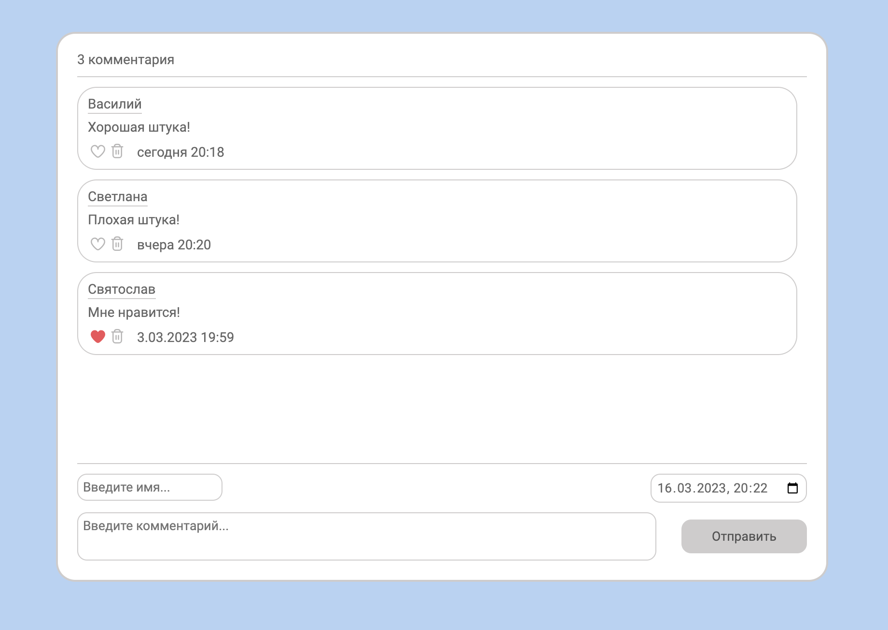
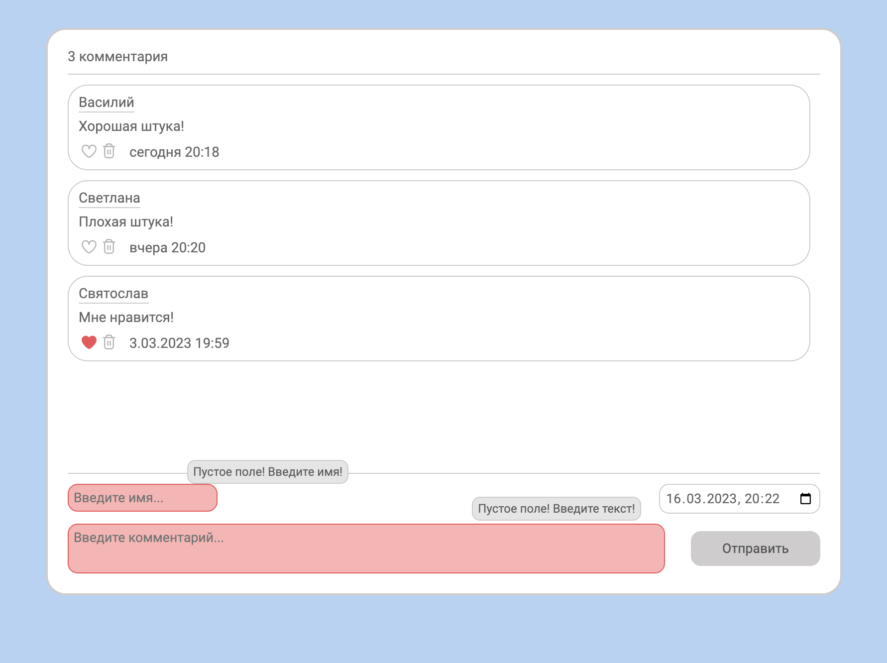
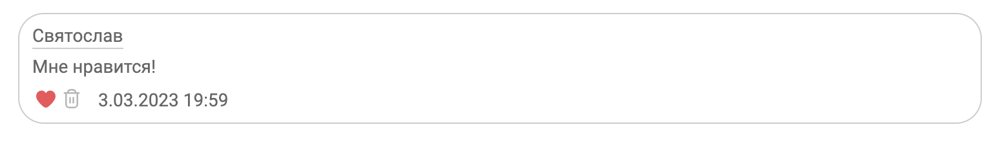
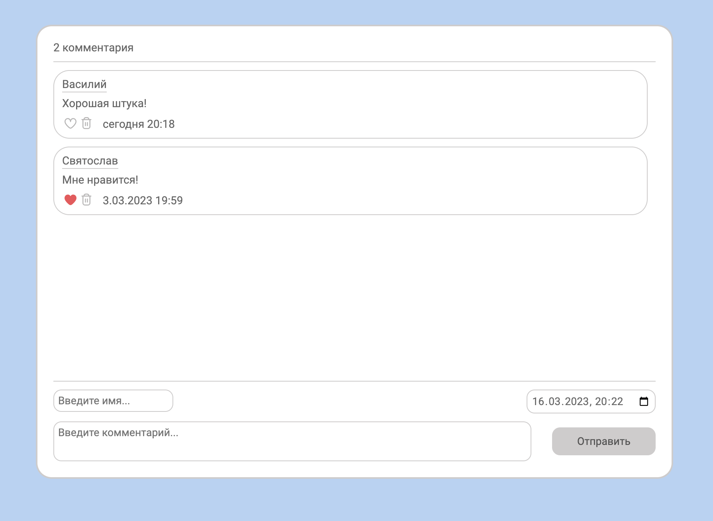

Блок Комментариев
--------------

------------
### Использовано:
* HTML5
* SASS
* Flexbox
* Webpack
* onChange
* MVC
____________

* Валидация при отправке формы

____________

### Установка и запуск:
* `npm ci`
* `npm run build`
* `npm run serve`

____________

* Возможность отметить понравившийся комментарий

___________
### Рефакторинг:
- [ ] Добавить линтер
- [ ] Задействовать больше возможностей SCSS
  - [ ] Переменные
  - [ ] Расширение
- [ ] Добавить Адаптивность
- [ ] Добавить автоматический скролл вниз
- [ ] Добавить регулярное выражение в formatDate(date)
__________

* Возможность удалить комментарий

